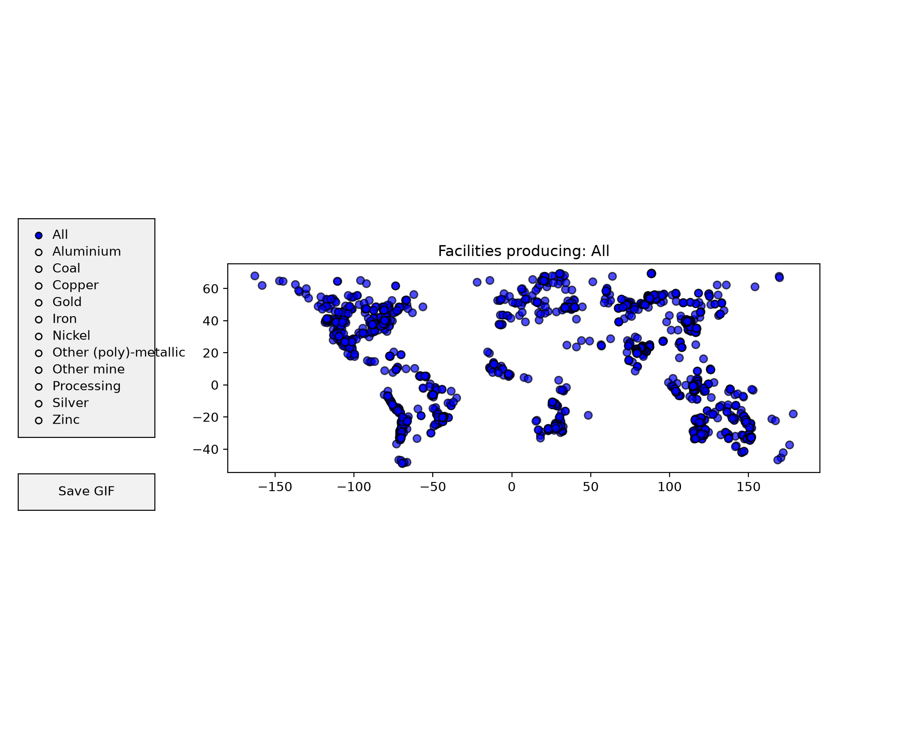
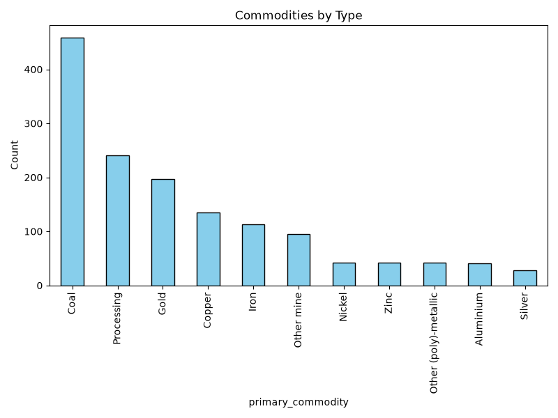
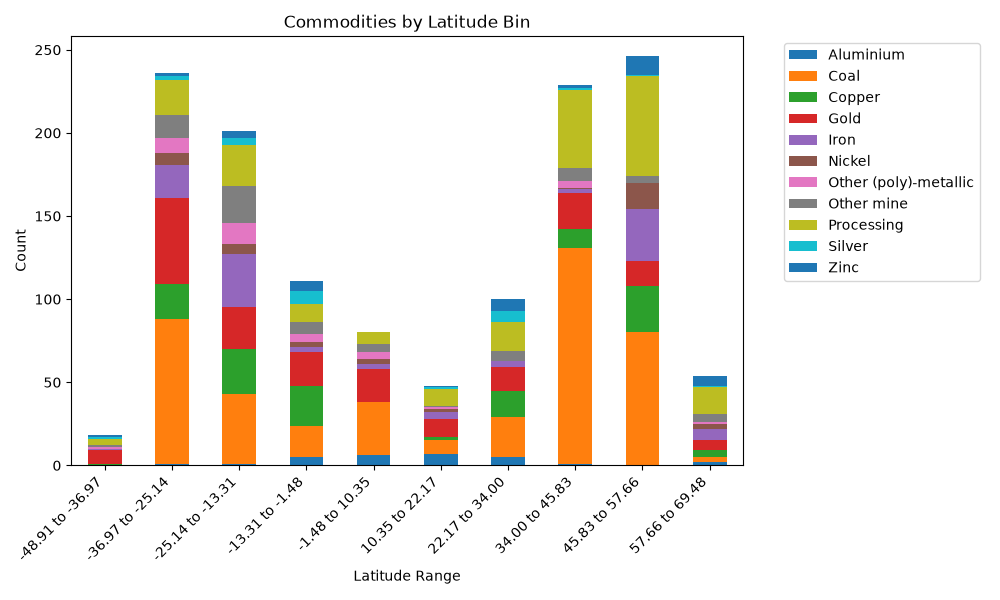
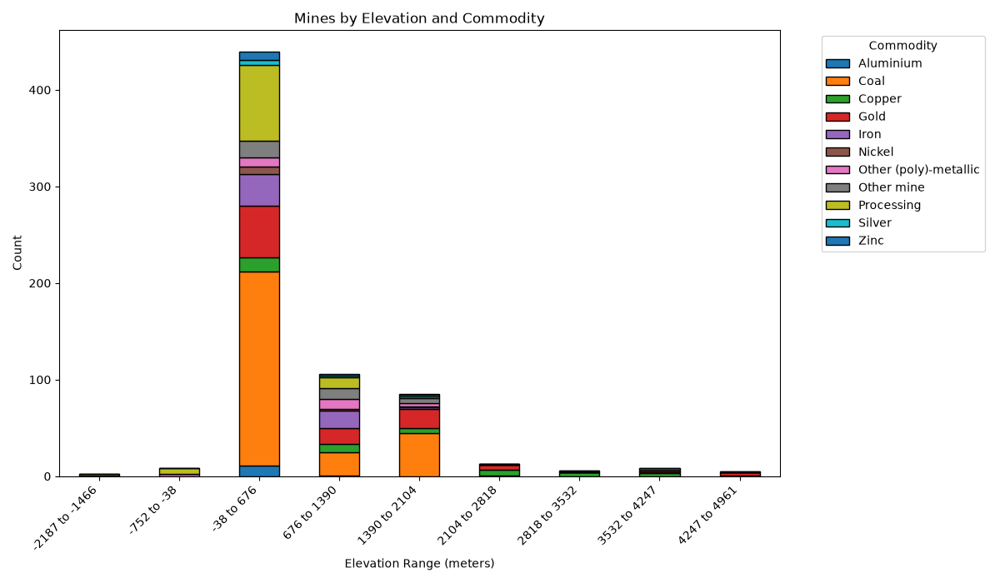

##  Elevation & Mines

- `brew install gdal`
- `./download_topography.sh`
- the 15-arcsecond granularity dataset from NOAA is 64 GB

--- 

- download https://zenodo.org/records/7369478 
- `python3 display_mines.py`

## Mine Locations

## Mines by Commodity

## Mines by Commodity and Latitude

TODO: normalize latitude bands by land area and population

## Mines by Commodity and Elevation

